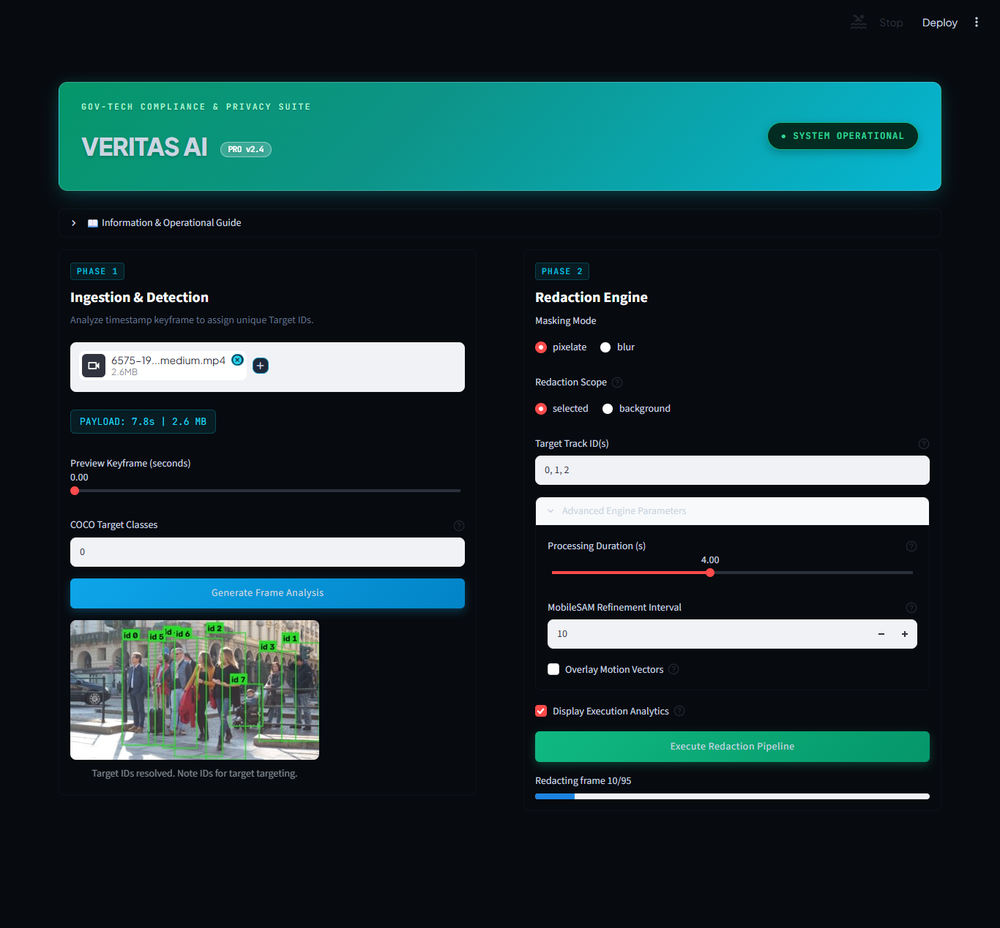
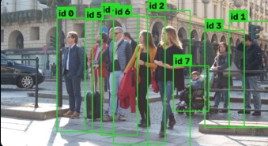
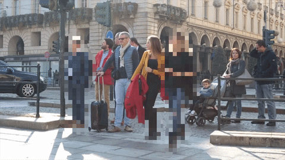
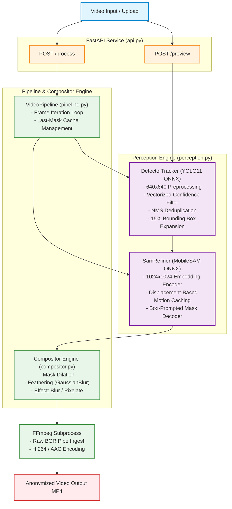
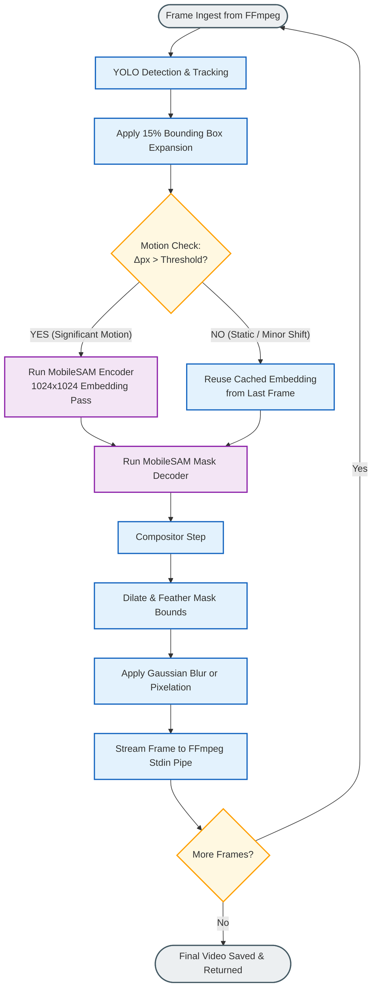

# Veritas: Autonomous Real-Time Video Anonymization Engine


An end-to-end, privacy-first automated video redaction pipeline. **Veritas** leverages **YOLO** for spatial detection, **MobileSAM** for zero-shot promptable instance segmentation, and spatial tracking to anonymize moving human targets, faces, or objects without cloud dependencies.

 

---

## 📌 Demonstration & Visuals

> **Note:** Below are target visual references showcasing how the processing pipeline operates in real time.

| Step | Visual Output | Description |
| :--- | :---: | :--- |
| **1. Target Selection** |  | Bounding box detected via YOLO and highlighted in the interface for target tracking. |
| **3. Final Output** |  | Feathered Gaussian blur applied dynamically over the target across all moving frames. |

---

## 🚨 Problem Statement

Manual video anonymization for compliance (such as GDPR, HIPAA, or law enforcement records) requires frame-by-frame masking, which is labor-intensive and error-prone. Modern neural network approaches often suffer from two major limitations:

1. **Bounding Box Over-clipping:** Traditional rectangular bounding box blurs either leak facial features during rotation/motion blur or redact vast non-sensitive background areas.

2. **Compute Heavy Transformers:** Running zero-shot segmentation models like Segment Anything (SAM) on every video frame generates massive latency bottlenecks, especially in non-GPU or edge environments.

---

## 🛠️ The Solution

**Veritas** solves this by pairing low-overhead **spatial object detection** with **box-displacement mask caching**:

- **Precise Boundary Segmentation:** Uses MobileSAM to create exact pixel-level masks rather than rigid rectangles.

- **Smart Motion Caching:** Instead of running the heavy MobileSAM image encoder on every frame, the engine evaluates bounding box displacement ($\Delta x, \Delta y$). Full transformer re-segmentation only triggers when significant spatial motion occurs, falling back to fast OpenCV spatial tracking for intermediate frames.

- **Out-of-Bounds Padding:** Automatically applies a **15% expansion margin** to YOLO predictions prior to mask prompt generation, ensuring motion blur, chin contours, and fast-moving limbs remain completely obscured.

---

## 🏗️ System Architecture



---

## 🔄 Processing Pipeline



1. **Frame Ingestion:** Input frames are scaled and processed by the YOLO ONNX runtime session.

2. **IoU Spatial Tracking:** Bounding boxes are tracked frame-by-frame using spatial Intersection over Union (IoU) matching.

3. **Displacement Check:** Bounding box coordinates are compared against the last SAM encoding state.

4. **Conditional Transformer Passes:** MobileSAM re-encodes full spatial embeddings only when motion exceeds threshold conditions.

5. **Compositing:** Masks are dilated, softly feathered, and composited back into the raw video array using OpenCV Gaussian operations.

---

## 📊 Performance & Metrics

The pipeline was benchmarked under strict CPU-only execution constraints to establish realistic performance baselines on non-GPU hardware:

| Benchmark Metric | Value |
| :--- | :--- |
| **Test Environment** | Pure CPU Local Execution |
| **Input Clip** | 89 frames (~3 seconds @ 30 FPS) |
| **Active Targets** | 2 Simultaneous Track IDs |
| **MobileSAM Refinements** | **13 Calls** (Reduced from 89 calls via motion caching) |
| **Processing Speed** | **~0.13 - 0.18 FPS** |
| **Total Processing Time** | **~486.9 - 665.9 seconds** |

> **Technical Trade-off Note:**  
> MobileSAM's Vision Transformer (ViT) encoder requires processing full $1024 \times 1024$ image arrays, taking ~35–50 seconds per pass on standard x86 CPU architectures. By implementing displacement-based caching, **Veritas reduced raw transformer execution calls by over 85%**, enabling functional edge anonymization without requiring CUDA GPUs.

---

## ⚡ Tech Stack

- **Backend Framework:** FastAPI, Uvicorn
- **Computer Vision:** OpenCV (`cv2`), NumPy, FFmpeg
- **Inference Engine:** ONNX Runtime (`onnxruntime`)
- **Machine Learning Models:** YOLO (Detection), MobileSAM (Segmentation)

---

## 🚀 Getting Started

### Prerequisites

- **Python 3.10+**
- **FFmpeg** installed and accessible in your system PATH.

---

### Local Installation & Setup

#### 1. Clone the Repository

```bash
git clone https://github.com/your-username/veritas.git
cd veritas
```

#### 2. Create and Activate a Virtual Environment

**Linux/macOS:**

```bash
python3 -m venv venv
source venv/bin/activate
```

**Windows (PowerShell):**

```powershell
python -m venv venv
.\venv\Scripts\Activate.ps1
```

#### 3. Install Dependencies

```bash
pip install --upgrade pip
pip install -r requirements.txt
```

#### 4. Verify ONNX Model Weights

Ensure the required ONNX model files are placed in the root directory (or as configured in `perception.py`):

```text
yolo11n.onnx
sam_encoder.onnx
sam_decoder.onnx
```

#### 5. Run the API

Start the FastAPI server using Uvicorn:

```bash
uvicorn api:app --reload --host 0.0.0.0 --port 8000
```

Once running, access the interactive API documentation:

- **Swagger UI:** http://localhost:8000/docs
- **Health Check:** http://localhost:8000/health

---

## ⚠️ Known Limitations

1. **CPU Speed Bottleneck:** Standard CPU execution limits real-time throughput ($<0.2\text{ FPS}$) due to transformer attention layers. It is best suited for offline asynchronous batch processing rather than live streaming without GPU acceleration.

2. **Track ID Drops on Hard Occlusions:** Simple spatial IoU tracking can drop track IDs if a target is fully obscured by an object or exits the frame completely before re-entering.

3. **Extreme Motion Lag:** If a person moves at extremely high speeds while `motion_threshold_px` is set aggressively high, the cached mask can briefly lag behind the actual boundary before triggering a re-segmentation pass.

---

## 🛣️ Future Scope

- [ ] **Hardware Acceleration:** Integrate ONNX Runtime `CUDAExecutionProvider` / TensorRT to boost execution speed from 0.18 FPS to 30+ FPS.
- [ ] **Model Quantization:** Implement dynamic INT8 quantization for the MobileSAM encoder to reduce memory footprint and CPU compute time by ~70%.
- [ ] **DeepSORT / ByteTrack Integration:** Replace basic IoU spatial tracking with Kalman filter-based tracking to handle long-term target occlusions seamlessly.
- [ ] **Point-Prompt Interface:** Allow UI users to manually click specific subjects to generate prompt point embeddings for custom mask tracking.

---

## 📄 License

Distributed under the MIT License. See `LICENSE` for more information.
